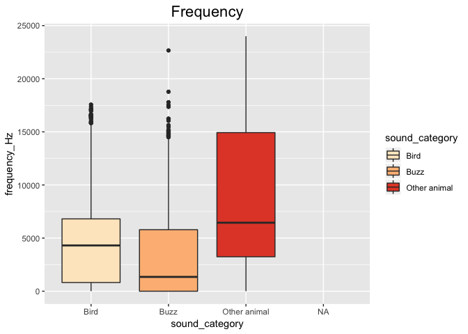
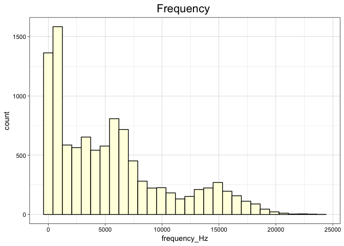
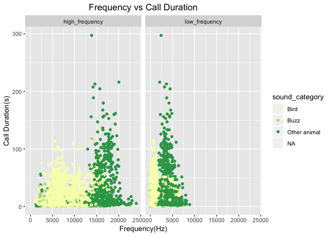
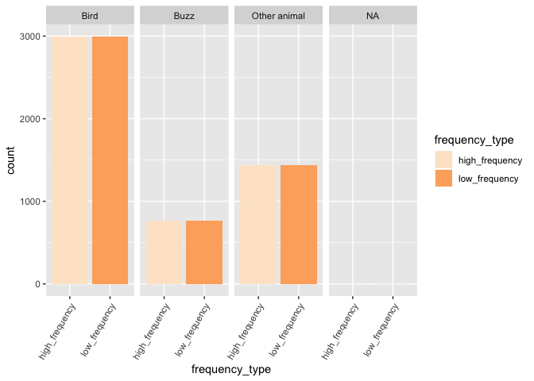
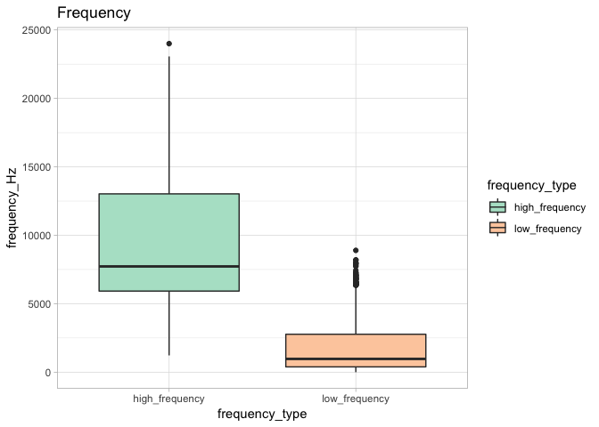
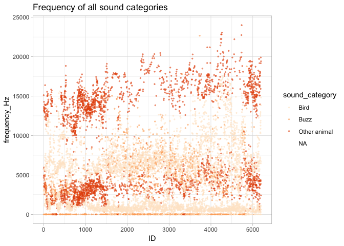
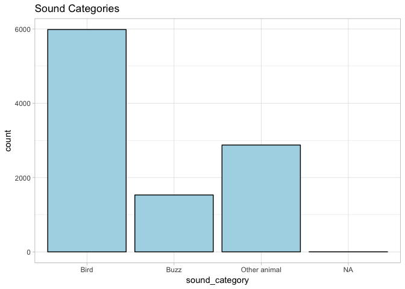

```r
library("tidyverse")
```

```
## ── Attaching packages ──────────────────────────────────────────── tidyverse 1.2.1 ──
```

```
## ✔ ggplot2 3.1.0     ✔ purrr   0.2.5
## ✔ tibble  2.0.0     ✔ dplyr   0.7.8
## ✔ tidyr   0.8.2     ✔ stringr 1.3.1
## ✔ readr   1.3.1     ✔ forcats 0.3.0
```

```
## ── Conflicts ─────────────────────────────────────────────── tidyverse_conflicts() ──
## ✖ dplyr::filter() masks stats::filter()
## ✖ dplyr::lag()    masks stats::lag()
```


```r
bird_calls1 <- 
  readr::read_csv("~/Downloads/Bird_calls-master-2/complete_BirdCall_data_table.csv")
```

```
## Parsed with column specification:
## cols(
##   Selection = col_double(),
##   View = col_character(),
##   Channel = col_double(),
##   `Begin Time (s)` = col_double(),
##   `End Time (s)` = col_double(),
##   `Low Freq (Hz)` = col_double(),
##   `High Freq (Hz)` = col_double(),
##   `Sound category` = col_character(),
##   `Additional information` = col_character()
## )
```


```r
bird_calls1 <- 
  bird_calls1 %>% 
  dplyr::rename(
    selection= Selection,
    view= View,
    channel= Channel,
    begin_time_s= `Begin Time (s)`,
    sound_category= `Sound category`,
    end_time_s= `End Time (s)`,
    low_frequency= `Low Freq (Hz)`,
    high_frequency= `High Freq (Hz)`,
    additional_information= `Additional information`)
```


```r
bird_calls1 <- tibble::rowid_to_column(bird_calls1, "ID")
bird_calls1
```

```
## # A tibble: 5,197 x 10
##       ID selection view  channel begin_time_s end_time_s low_frequency
##    <int>     <dbl> <chr>   <dbl>        <dbl>      <dbl>         <dbl>
##  1     1         1 Spec…       1        0           1.71         2986.
##  2     2         2 Spec…       1        0.335       1.83         5752.
##  3     3         3 Spec…       1        0.346       1.79            0 
##  4     4         4 Spec…       1        6.85        8.72         4652 
##  5     5         5 Spec…       1        7.52       14.9          2909.
##  6     6         6 Spec…       1       14.1        16.2          4863.
##  7     7         7 Spec…       1       18.4        23.6          2597.
##  8     8         8 Spec…       1       20.1        21.9          5958 
##  9     9         9 Spec…       1       26.7        29.0          3489 
## 10    10        10 Spec…       1       33.6        36.2          4969.
## # … with 5,187 more rows, and 3 more variables: high_frequency <dbl>,
## #   sound_category <chr>, additional_information <chr>
```


```r
bird_calls <- 
  bird_calls1 %>% 
  select(ID, view, channel, begin_time_s, end_time_s, low_frequency, high_frequency, sound_category)
bird_calls
```

```
## # A tibble: 5,197 x 8
##       ID view  channel begin_time_s end_time_s low_frequency high_frequency
##    <int> <chr>   <dbl>        <dbl>      <dbl>         <dbl>          <dbl>
##  1     1 Spec…       1        0           1.71         2986.          5696.
##  2     2 Spec…       1        0.335       1.83         5752.         15119.
##  3     3 Spec…       1        0.346       1.79            0           3574.
##  4     4 Spec…       1        6.85        8.72         4652          13639.
##  5     5 Spec…       1        7.52       14.9          2909.          5677.
##  6     6 Spec…       1       14.1        16.2          4863.         13216.
##  7     7 Spec…       1       18.4        23.6          2597.          5677.
##  8     8 Spec…       1       20.1        21.9          5958          13427.
##  9     9 Spec…       1       26.7        29.0          3489          14273.
## 10    10 Spec…       1       33.6        36.2          4969.         13110.
## # … with 5,187 more rows, and 1 more variable: sound_category <chr>
```


```r
bird_calls <- 
  bird_calls %>% 
  gather(low_frequency, high_frequency, 
         key= "frequency_type", 
         value= "frequency_Hz") %>% 
  arrange(ID) 
bird_calls
```

```
## # A tibble: 10,394 x 8
##       ID view  channel begin_time_s end_time_s sound_category
##    <int> <chr>   <dbl>        <dbl>      <dbl> <chr>         
##  1     1 Spec…       1        0           1.71 Bird          
##  2     1 Spec…       1        0           1.71 Bird          
##  3     2 Spec…       1        0.335       1.83 Other animal  
##  4     2 Spec…       1        0.335       1.83 Other animal  
##  5     3 Spec…       1        0.346       1.79 Buzz          
##  6     3 Spec…       1        0.346       1.79 Buzz          
##  7     4 Spec…       1        6.85        8.72 Other animal  
##  8     4 Spec…       1        6.85        8.72 Other animal  
##  9     5 Spec…       1        7.52       14.9  Bird          
## 10     5 Spec…       1        7.52       14.9  Bird          
## # … with 10,384 more rows, and 2 more variables: frequency_type <chr>,
## #   frequency_Hz <dbl>
```


```r
bird_calls <- 
  bird_calls %>% 
  mutate(call_duration_s=end_time_s-begin_time_s) %>% 
  select(ID, view, channel, begin_time_s, end_time_s, call_duration_s, frequency_type,frequency_Hz, sound_category) 
   
bird_calls
```

```
## # A tibble: 10,394 x 9
##       ID view  channel begin_time_s end_time_s call_duration_s
##    <int> <chr>   <dbl>        <dbl>      <dbl>           <dbl>
##  1     1 Spec…       1        0           1.71            1.71
##  2     1 Spec…       1        0           1.71            1.71
##  3     2 Spec…       1        0.335       1.83            1.49
##  4     2 Spec…       1        0.335       1.83            1.49
##  5     3 Spec…       1        0.346       1.79            1.44
##  6     3 Spec…       1        0.346       1.79            1.44
##  7     4 Spec…       1        6.85        8.72            1.87
##  8     4 Spec…       1        6.85        8.72            1.87
##  9     5 Spec…       1        7.52       14.9             7.42
## 10     5 Spec…       1        7.52       14.9             7.42
## # … with 10,384 more rows, and 3 more variables: frequency_type <chr>,
## #   frequency_Hz <dbl>, sound_category <chr>
```


```r
library(RColorBrewer)
```


```r
bird_calls %>% 
  ggplot(aes(x=sound_category, y=frequency_Hz, fill=sound_category))+
  geom_boxplot(position="dodge")+
  theme(plot.title = element_text(size=rel(1.5), hjust=0.5))+
  scale_fill_brewer(palette = "OrRd")+
  labs(title = "Frequency")
```

```
## Warning: Removed 2 rows containing non-finite values (stat_boxplot).
```

<!-- -->


```r
bird_calls %>% 
  ggplot(aes(x=frequency_Hz))+
  geom_histogram(fill="lightyellow", color="black")+
  labs(title="Frequency ")+
  theme_linedraw()+
  theme(plot.title = element_text(size=rel(1.5), hjust=0.5))
```

```
## `stat_bin()` using `bins = 30`. Pick better value with `binwidth`.
```

```
## Warning: Removed 2 rows containing non-finite values (stat_bin).
```

<!-- -->


```r
bird_calls %>% 
  ggplot(aes(x=frequency_Hz, y=call_duration_s, color=sound_category))+
  geom_jitter()+
  facet_wrap(~frequency_type)+
  labs(title="Frequency vs Call Duration", x="Frequency(Hz)", y= "Call Duration(s)")+
  scale_color_brewer(palette = "YlGn")+
  theme(plot.title = element_text(size=rel(1.25), hjust=0.5))
```

```
## Warning: Removed 2 rows containing missing values (geom_point).
```

<!-- -->


```r
bird_calls %>% 
  ggplot(aes(x=frequency_type, fill=frequency_type))+
  geom_bar(stat ="count")+
  facet_grid(~sound_category)+
  theme(axis.text.x = element_text(angle = 60, hjust=1))+
  scale_fill_brewer(palette = "Oranges")
```

<!-- -->


```r
bird_calls %>% 
  ggplot(aes(x=frequency_type, y=frequency_Hz, fill=frequency_type))+
  geom_boxplot(position="dodge")+
  theme(legend.position = "right")+
  scale_fill_brewer(palette = "Pastel2")+
  labs(title = "Frequency")+
  theme_light()
```

```
## Warning: Removed 2 rows containing non-finite values (stat_boxplot).
```

<!-- -->


```r
bird_calls %>% 
  ggplot(aes(x=ID, y=frequency_Hz, color=sound_category))+
  geom_jitter(size=0.5, alpha=0.5)+
  scale_color_brewer(palette = "Oranges")+
  theme_light()+
  labs(title = "Frequency of all sound categories")
```

```
## Warning: Removed 2 rows containing missing values (geom_point).
```

<!-- -->


```r
bird_calls %>% 
  ggplot(aes(x=sound_category))+
  geom_bar(fill="lightblue", color="black")+
  labs(title="Sound Categories")+
  theme_light()
```

<!-- -->


