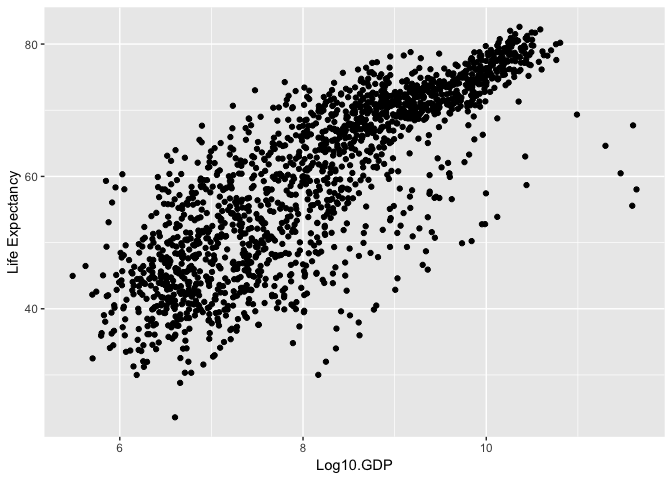

## Instructions
Answer the following questions and complete the exercises in RMarkdown. Please embed all of your code, keep track of your versions using git, and push your final work to our [GitHub repository](https://github.com/FRS417-DataScienceBiologists). I will randomly select a few examples of student work at the start of each session to use as examples so be sure that your code is working to the best of your ability.

## Load the libraries

```r
library(tidyverse)
```

```
## ── Attaching packages ──────────────────────────────────────────── tidyverse 1.2.1 ──
```

```
## ✔ ggplot2 3.1.0     ✔ purrr   0.2.5
## ✔ tibble  2.0.0     ✔ dplyr   0.7.8
## ✔ tidyr   0.8.2     ✔ stringr 1.3.1
## ✔ readr   1.3.1     ✔ forcats 0.3.0
```

```
## ── Conflicts ─────────────────────────────────────────────── tidyverse_conflicts() ──
## ✖ dplyr::filter() masks stats::filter()
## ✖ dplyr::lag()    masks stats::lag()
```

```r
library("skimr")
library("RColorBrewer")
```


## Resources
The idea for this assignment came from [Rebecca Barter's](http://www.rebeccabarter.com/blog/2017-11-17-ggplot2_tutorial/) ggplot tutorial so if you get lost go have a look. Please do not copy and paste her code!  

## Gapminder
For this assignment, we are going to use the dataset [gapminder](https://cran.r-project.org/web/packages/gapminder/index.html). Gapminder includes inf""ormation about economics, population, and life expectancy from countries all over the world. You will need to install it before use.


```r
library("gapminder")
```


Please load the data into a new object called gapminder.

```r
gapminder <- 
  gapminder::gapminder
```

1. Explore the data using the various function you have learned. Is it tidy, are there any NA's, what are its dimensions, what are the column names, etc.


```r
gapminder %>% 
  skimr::skim()
```

```
## Skim summary statistics
##  n obs: 1704 
##  n variables: 6 
## 
## ── Variable type:factor ─────────────────────────────────────────────────────────────
##   variable missing complete    n n_unique
##  continent       0     1704 1704        5
##    country       0     1704 1704      142
##                              top_counts ordered
##  Afr: 624, Asi: 396, Eur: 360, Ame: 300   FALSE
##      Afg: 12, Alb: 12, Alg: 12, Ang: 12   FALSE
## 
## ── Variable type:integer ────────────────────────────────────────────────────────────
##  variable missing complete    n    mean       sd    p0        p25     p50
##       pop       0     1704 1704 3e+07    1.1e+08 60011 2793664    7e+06  
##      year       0     1704 1704  1979.5 17.27     1952    1965.75  1979.5
##       p75       p100     hist
##  2e+07       1.3e+09 ▇▁▁▁▁▁▁▁
##   1993.25 2007       ▇▃▇▃▃▇▃▇
## 
## ── Variable type:numeric ────────────────────────────────────────────────────────────
##   variable missing complete    n    mean      sd     p0     p25     p50
##  gdpPercap       0     1704 1704 7215.33 9857.45 241.17 1202.06 3531.85
##    lifeExp       0     1704 1704   59.47   12.92  23.6    48.2    60.71
##      p75      p100     hist
##  9325.46 113523.13 ▇▁▁▁▁▁▁▁
##    70.85     82.6  ▁▂▅▅▅▅▇▃
```

```r
glimpse(gapminder)
```

```
## Observations: 1,704
## Variables: 6
## $ country   <fct> Afghanistan, Afghanistan, Afghanistan, Afghanistan, Af…
## $ continent <fct> Asia, Asia, Asia, Asia, Asia, Asia, Asia, Asia, Asia, …
## $ year      <int> 1952, 1957, 1962, 1967, 1972, 1977, 1982, 1987, 1992, …
## $ lifeExp   <dbl> 28.801, 30.332, 31.997, 34.020, 36.088, 38.438, 39.854…
## $ pop       <int> 8425333, 9240934, 10267083, 11537966, 13079460, 148803…
## $ gdpPercap <dbl> 779.4453, 820.8530, 853.1007, 836.1971, 739.9811, 786.…
```

```r
colnames(gapminder)
```

```
## [1] "country"   "continent" "year"      "lifeExp"   "pop"       "gdpPercap"
```


```r
gapminder %>% 
  purrr::map_df(~sum(is.na(.))) %>% 
  tidyr::gather(key="variables", value="num_nas") %>% 
  arrange(desc(num_nas))
```

```
## # A tibble: 6 x 2
##   variables num_nas
##   <chr>       <int>
## 1 country         0
## 2 continent       0
## 3 year            0
## 4 lifeExp         0
## 5 pop             0
## 6 gdpPercap       0
```
##There is no NAs in the data

2. We are interested in the relationship between per capita GDP and life expectancy; i.e. does having more money help you live longer on average. Make a quick plot below to visualize this relationship.


```r
ggplot(data=gapminder, mapping= aes(x=gdpPercap , y=lifeExp))+
  geom_jitter()+
  labs(tittle= "GDP vs. Life Expectancy", x= "GDP", y= "Life Expectancy")
```

<!-- -->


3. There is extreme disparity in per capita GDP. Rescale the x axis to make this easier to interpret. How would you characterize the relationship?
-Log-linear relationship

```r
ggplot(data=gapminder, mapping= aes(x=log(gdpPercap) , y=lifeExp))+
  geom_jitter()+
  labs(tittle= "GDP vs. Life Expectancy", x= "Log10.GDP", y= "Life Expectancy")
```

<!-- -->


4. This should look pretty dense to you with significant overplotting. Try using a faceting approach to break this relationship down by year.


```r
gapminder %>% 
  ggplot(aes(x=gdpPercap, y=lifeExp))+
  geom_jitter()+
  scale_x_log10()+
  facet_wrap(~year)+
  labs(tittle= "GDP vs. Life Expectancy", x= "Log10.GDP", y= "Life Expectancy")
```

<!-- -->


5. Simplify the comparison by comparing only 1952 and 2007. Can you come to any conclusions?


```r
gapminder %>% 
  filter(year==1952 | year==2007) %>% 
  ggplot(aes(x=gdpPercap, y=lifeExp))+
  geom_jitter()+
  scale_x_log10()+
  facet_wrap(~year)+
  labs(tittle= "GDP vs. Life Expectancy", x= "Log10.GDP", y= "Life Expectancy (1952-2007")
```

<!-- -->

6. Let's stick with the 1952 and 2007 comparison but make some aesthetic adjustments. First try to color by continent and adjust the size of the points by population. Add `+ scale_size(range = c(0.1, 10), guide = "none")` as a layer to clean things up a bit.


```r
gapminder %>% 
  filter(year==1952 | year==2007) %>% 
  ggplot(aes(x=gdpPercap, y=lifeExp, color=continent, size= pop))+
  geom_jitter()+
  scale_x_log10()+
  facet_wrap(~year)+
  labs(tittle= "GDP vs. Life Expectancy", x= "Log10.GDP", y= "Life Expectancy (1952-2007")+
  scale_size(range= c(0.1, 10), guid="none")+
  theme_linedraw()
```

<!-- -->


7. Although we did not introduce them in lab, ggplot has a number of built-in themes that make things easier. I like the light theme for these data, but you can see lots of options. Apply one of these to your plot above.

```r
?theme_light
```

8. What is the population for all countries on the Asian continent in 2007? Show this as a barplot.


```r
gapminder %>%
  filter(continent=="Asia", year==2007) %>% 
   ggplot(aes(x=reorder(country, +pop), y=pop))+
    geom_col()+
  labs(title = "Population in Asia (2007)",
       x = "Population",
       y = "Country")+
  theme_linedraw()+ 
  theme(plot.title = element_text(size = rel(1.5), hjust = 0.5))+
  coord_flip()
```

<!-- -->


9. You should see that China's population is the largest with India a close second. Let's focus on China only. Make a plot that shows how population has changed over the years.


```r
gapminder %>% 
  filter(country=="China") %>%
  ggplot(aes(x=year, y=pop))+
  geom_bar(stat = "identity")+
  labs(title="Population of China over time", x="Year", y="Population")
```

<!-- -->


10. Let's compare China and India. Make a barplot that shows population growth by year using `position=dodge`. Apply a custom color theme using RColorBrewer.


```r
?RColorBrewer
```


```r
gapminder %>% 
  filter(country=="China"| country=="India") %>% 
  ggplot(aes(x=year, y=pop, fill=country))+
  geom_bar(stat="identity", position="dodge")+
  scale_fill_brewer(palette = "colorblindFriendly")+
  labs(title = "Population over time in China and India",
       x = "Year",
       y = "Population")
```

```
## Warning in pal_name(palette, type): Unknown palette colorblindFriendly
```

<!-- -->


## Push your final code to [GitHub](https://github.com/FRS417-DataScienceBiologists)
Make sure that you push your code into the appropriate folder. Also, be sure that you have check the `keep md` file in the knit preferences.
